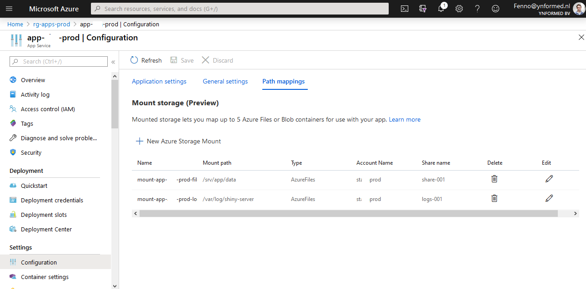

# Making Shiny apps in Linux container work in Azure App Service

Some obstacles I encountered while getting it to work, and how I overcame them.

---

Fenno Vermeij, April 11, 2020

---

Over the last months and years, I have helped maintaining an infrastructure of shiny apps that me and my colleagues have created. First as plain R apps using [shiny-server](https://rstudio.com/products/shiny/shiny-server/), then moving them to Docker images, using [shinyproxy](https://www.shinyproxy.io/) to orchestrate the serving of containers. Recently, we decided to move our infrastructure to Azure. This has several advantages:

* Azure App Service has built-in authentication using OAuth2, meaning without effort from our R programmers, we can add SSO that doesn't require us to handle any passwords. Customers can just log in with their usual microsoft account (which we add as a guest user to our Azure Tenant).
* Azure has many built-in services like logging, autoscaling rules, a private container registry, and several more features, some of which are mentioned in the rest of this blog. In general, stuff that would normally take time for us to configure, can often be relatively easily turned on, since Azure already provides a 'default' set of tools.
* Easier deployment of apps, and updating of images. Deploying can be done with an ARM template, and updating an image only involves asking the programmer to push their new image to the container registry.
* More reliably infrastructure. Moving from IaaS to PaaS means no more worrying about software upgrades and other issues like a full disk. Security updates for the app itself are still an issue, but that can usually be handled by periodically rebuilding the app with a newer base image.

While we are not completely finished with the migration, it is mostly done, and all the code/templates are written. In this blog I want to highlight the issues I ran into, hopefully to prevent anyone other than myself from wasting time on these issues.

## Preventing sensitive data in the image

When working with a container registry, you don't want data to enter the image, since anyone we can access the registry, can download the data in the image. Previously, we handled this by only giving sysadmins access to the registry, but that caused more work for us.

In Azure App Service, Linux containers can have [path mappings](https://docs.microsoft.com/en-us/azure/app-service/containers/how-to-serve-content-from-azure-storage). This allows us to create an Azure File Share, and mount it to the App Service. Then, we give only the relevant person access to this file share, and let them upload their data to that share. The share is mounted to `/data` or some other folder, where the programmer can then access it with their app.

Here is an example of creating this path mapping with the AZ CLI. Unfortunately this feature is still in preview, so as far as I know, it is not supported in ARM templates yet.

    #!/bin/bash
    # data will be mounted to $data_dir in the app
    # $resource_name is the name of the Web App Service
    # hopefully all other variable names speak for themselves
    az webapp config storage-account add -g $resource_group -n $resource_name \
        --custom-id "mount-$resource_name-files-001" \
        --storage-type AzureFiles \
        --account-name $storage_account_name \
        --share-name share-001 \
        --mount-path $data_dir \
        --access-key "$(az storage account keys list -n $storage_account_name | jq '.[0]["value"]' -r)"

## Bug in httpuv with authentication

Unfortunately, when enabling AAD authentication, the shiny apps stopped working. This is because Azure inserts some middleware, [easyauth](https://github.com/cgillum/easyauth), in between the user and the app when enabling AAD authentication. Unfortunately, this middleware inserts some headers that don't play nice with the package used in shiny for webtraffic: httpuv.

This is the kind of issue that took me a few hours to debug: first I tried mindless googling, that didn't work, so I had to trace the issue exactly, and once I finally figured out where the issue lied, I remember one single, perfectly placed google search leading me to the stackoverflow post with the solution, [here](https://stackoverflow.com/questions/56797036/how-do-i-get-shiny-server-to-working-with-azure-active-directory/58541479#58541479). Thanks lhaferkamp!

The issue ended up being a bug in httpuv version 1.5.2 and prior.

For now, the most recent version on CRAN is 1.5.2, so in our Dockerfile, we have to install a development version of httpuv using `RUN R -e "devtools::install_github('rstudio/httpuv')"`. Once version 1.5.3 is released, we can remove that hack.

## Websockets don't work with AAD Authentication

This manifested itself in a public shiny app working, but a private shiny app just showing some blank or non-functional page. Inspecting the console revealed that the page 'quit' after attempting to setup a websocket connection. After some googling, I found [this page on the Azure feedback forum](https://feedback.azure.com/forums/169385-web-apps/suggestions/36489109-add-support-for-websocket-connections-when-aad-aut) where somebody mentioned websockets aren't supported with AAD Authentication on, and asked for this to be added... a year ago. There is no response on this issue yet, so I don't expect this to fixed soon. Luckily, we can disable websockets in shiny, by using shiny-server in our docker image!

Basically, we enforced everyone to use the [rocker/shiny-verse](https://hub.docker.com/r/rocker/shiny-verse) base image, which is an image that comes with tidyverse, shiny, shiny-server. These are requirements for basically every shiny app, and the last of the three allows us to use websockets. We add a shiny-server.conf file like this:

    run_as shiny;

    server {

    listen 80 0.0.0.0;
    # This configuration makes sure that shiny_server works if websockets are disabled
    disable_protocols websocket;
    location / {
        app_dir /app;
        log_dir /var/log/shiny-server;
    }
    }

Remember, we can add this file with something like `COPY shiny-server.conf /etc/shiny-server/shiny-server.conf`. That will make sure websockets are disabled.

## Managing API permissions in the Enterprise app

When enabling authentication, you will have to create 2 resources in the Azure Active Directory: an enterprise app, which handles the actual connection to the app, including the login/logout urls, and the service principal, which has the list of users that are allowed to access the app. The service principal is relatively straightforward, and I didn't have any issues with it. However, the enterprise app has some specific settings that tripped me up.

First of all, the authentication settings. Mostly, the default settings do fine, but remember you only have to enable 'ID tokens' as an implicit grant. If you turn this option off, the app won't work. If you turn 'Access tokens' on, the app will still work, but there's not much point.

Also, just set the account type to single tenant. Either it's a public app, which means anyone can access it without logging in, or it's a single-tenant app, which means you, and your customers (read: guest users) can log in. Multitenant has it's uses, but it's more difficult to configure, so I reccommend just sticking with single tenant if it suits your need.

Second of all, the permissions. Don't get tripped up, User.Read is all you need. For guest users, you need to give admin consent so they don't get an error saying they aren't allowed to give consent. This can be done in AZ CLI like this:

    #!/bin/bash
    # resource_name is the name of the service principal name you created
    spAppId="$(az ad app list --display-name $resource_name | jq '.[0]["appId"]' -r)"
    az ad app permission admin-consent --id $spAppId

Beware you do need to have the role of 'Application administrator' to do this.

## Enabling https and custom domain

Lastly, a quick tip on enabling https with a custom domain. I definitely reccommend creating an app service domain in Azure, that lets you manage your DNS records automatically. This saves a lot of manual labor setting CNAME records. In an ARM template, we can configure a CNAME record something like this:

    #!javascript
    // domain_name is the domain of the website (example: test.com)
    // resource_name is the name of the Web App Service
    {
        "type": "Microsoft.Network/dnszones/CNAME",
        "apiVersion": "2018-05-01",
        "name": "[concat(parameters('domain_name'), '/', parameters('subdomain'))]",
        "properties": {
            "TTL": 3600,
            "CNAMERecord": {
                "cname": "[concat(parameters('resource_name'), '.azurewebsites.net')]"
            },
            "targetResource": {}
        }
    }

Then, you don't need to mess around with wildcard certificates to enable https on your App Service. We can automatically create what's called an 'App Service Managed Certificate', another preview feature which was one of the reasons for switching to Azure: all this stuff just seems to go automatically in Azure.
The only thing Azure needs is for the CNAME record to be set, proving you own the domain.

The ARM template for this is quite complex, but I plan on making it open source soon.

## Conclusion

Hopefully this shows off some of the features and obstacles you can encounter when deploying a (shiny) app in Azure. Let's just say, some of these issues took a few hours to solve, so if this can save one person the same hassle, I would be very happy.
